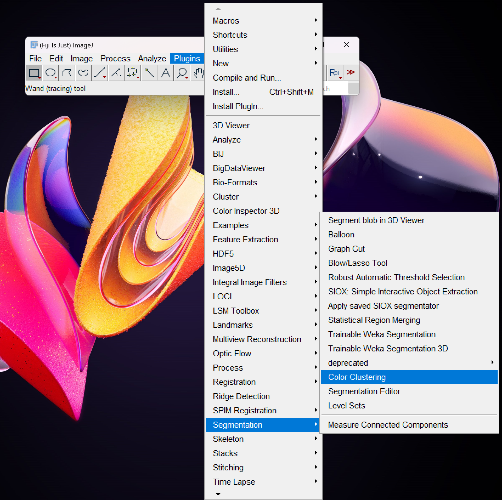
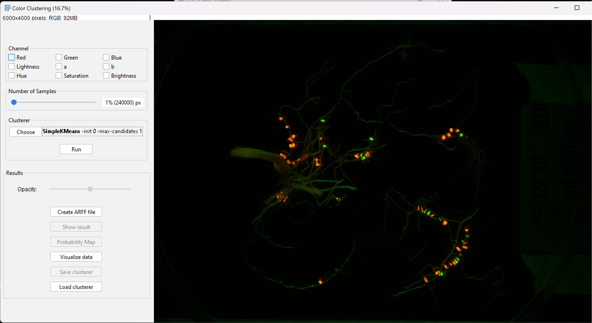
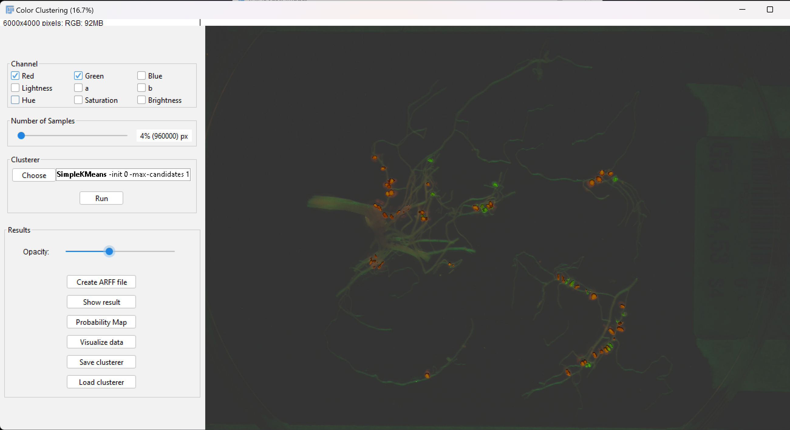
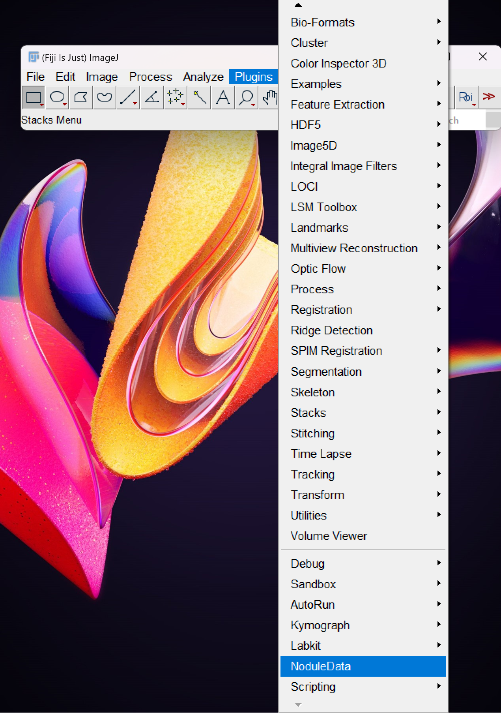
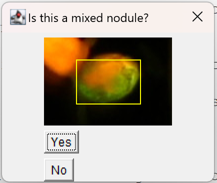
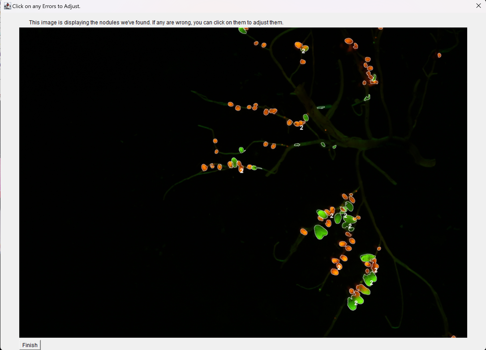

Nodule Segmentation
===================
This is an ImageJ plugin that takes as input images of fluoresced images of nodules on root systems,
and uses Color Clustering algorithms to outline, categorize, count, and measure nodules within the image.
It is extended from Weka's unsupervised ColorClustering plugin, and uses .model files generated from 
that plugin. 

For documentation of the source code, visit the documentation [website](https://indefiable.github.io/Nodule-Segmentation/).

Limitations
===========

Note that this plugin was made solely with red and green fluoresced nodules in mind. The images that are known to produce
sucessful output data are as shown in the tutorial. Other types/colors of nodules may be supported in the future with 
further development of the plugin. There is a lot that can be done/improved/expanded here. 

The size of the nodules with respect to he image also matter. 

Installation
============

First install [fiji](https://imagej.net/software/fiji/). Then download the .jar file in the releases on this github page,
and drop the .jar file into the plugins folder wherever you installed fiji. 

Before you can run Nodule Segmentation, you must generate a .model file for your dataset using Weka's color clustering plugin.

Generating the Model file
=========================
For a data set with similar characteristics, you will likely only need one .model file for the entire dataset.
To generate the file, you need to use Weka's Color Clustering plugin, a part of 
[Weka's trainable Segmentation](https://github.com/fiji/Trainable_Segmentation/tree/master). Note this comes with fiji. If 
you instead installed just ImageJ, you'll have to install weka separately.
Once installed, open ImageJ and an image from your dataset via ImageJ. Then, open the plugin under plugins -> Segmentation 
-> Color Clustering. There are a lot of settings here, and you can try different settings to optimize your output. After you 
run the plugin and are happy with the results, you can save the clusterer, which will be your model file. There are more 
detailed instructions on doing this below.

Instructions
============

1. Create your model file for your data set(instructions above).

2. Install the plugin to your installation of ImageJ (instructions above).

3. Run the plugin at plugins -> Nodule Segmentation.

4. Browse your files and select the image with the nodules and the model file generated earlier.

5. Let the program run. 

6. At the end, the segmented image pops up with the predicted nodules outlined. This is where manual input is allowed.
You can click on any of the outlines and delete, redraw, or edit the outline to correct any mistakes.

7. Once finished, click finish and you can choose where to save the data. 

Tutorial
========
First, we need to open the Color Clustering plugin to create our .model file. I recommend using FIJI, as it comes
preinstalled with many useful plugins, of which Color Clustering is among them. 

Nodule Segmentation" width="50%">

It will prompt you to select an image if you do not already have one opened via ImageJ. Alternatively, you can first open
an image with File -> Open. Once Color Clustering has opened with an image, you will see something like this.

This plugin has many different options for segmenting the image. The main idea is it uses various different algorithms 
to analyze and group the pixels by color. You'll want to select one or more channels. You can try various different
settings to try and get the best segmentation of your nodules. Here, I chose the red and green channels, and increased
the sample size to 4%. Hit run to generate the segmentation map. 

You can see that the image will look a little different. There's a convenient opacity slider to switch between looking
at your original image and looking at the segmented map.

If you're not satisfied with the output, you can change the settings and try again. Once you're satisfied, you can 
click save clusterer to save your .model file. 

Now that we have the .model file, we can load the Nodule Segmentation plugin. You can drop the .jar file into the FIJI\plugins 
wherever you've installed FIJI/ImageJ, and restart the program. Then it should show up under plugins. 

 Nodule Data" width="50%">

Once you open it, it will prompt you to choose two files from your computer. The first is the image you want to segment,
and the second is the .model file we just made. Once you do that, the program will start running. You may be prompted with a
 small portion of your image and a question. 

Once the program is done running, you'll be left with the following UI.

This UI shows the image with outlined ROI's, or Regions of Interest. These are what the algorithm determined were your 
nodules. This UI offers the opportunity to change and correct them. You can click on an ROI and you'll be given the option
to delete or redraw the ROI by hand. If the algorithm determined that the ROI is a clump, i.e. multiple nodules connected
into one, then that ROI will have a number next to it on the image, and you'll also have the ability to correct/redraw
 the entire clump. Let's see what it looks like to use the UI.

Deleting an ROI.

Outlining an ROI.

Working with Mixed nodules.

After you're done making edits, you can hit the finish button. You will then be prompted to choose a location to save the 
output data. The output data consists of an image with the ROI's outlined, the same image but with each ROI numbered, and 
a sheet of each numbered ROI, it's size (in pixels), and the number of green and red pixels in the ROI. 
